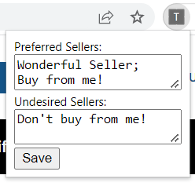

# TCGplayer Seller Flagger
This is a Chrome extension to flag preferred and undesired TCGplayer sellers.

## Instructions for use
All seller names must be separated by semi-colons. Seller names are case sensitive. Spaces and newlines are allowed. Data for this extension will be synchronized across Chrome browsers that you are logged in to.

